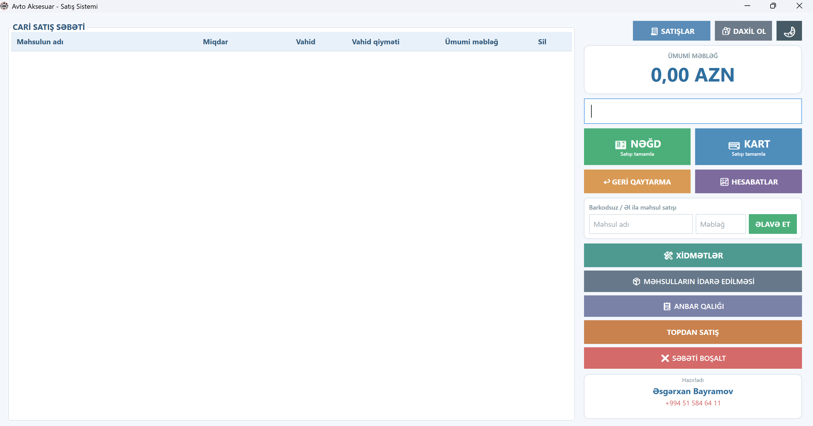

<h1 align="center">🚗 Avto Aksesuar - Satış Sistemi</h1>

<p align="center">
  <strong>Perakende satış, stok və inventar idarəetməsi üçün .NET 8 + WPF masaüstü POS sistemi</strong>
</p>

<p align="center">
  
  
  
  
  
  
</p>

---

## 📌 Layihə haqqında

**Avto Aksesuar - Satış Sistemi** avtomobil aksesuarları və pərakəndə satış müəssisələri üçün hazırlanmış Windows əsaslı **Point of Sale (POS)** və **stok idarəetmə** tətbiqidir.

Tətbiq gündəlik satış prosesini sürətləndirmək, məhsul stoklarını idarə etmək, nağd və kart ödənişlərini qeyd etmək, geri qaytarmaları izləmək və satış hesabatlarını hazırlamaq üçün nəzərdə tutulub.

Sistem **.NET 8, C#, WPF və SQLite** texnologiyaları üzərində qurulub və internet bağlantısı olmadan lokal işləyə bilir.

## 🖥️ Əsas ekran

> Aşağıdakı ekran görüntüsünü repository-də `assets/main/main-window.png` yolunda saxlayın.

<p align="center">
  
</p>

---

## ✨ Əsas xüsusiyyətlər

### 🛒 Sürətli satış
- Barkod oxuyucu ilə məhsul əlavə etmə
- Barkod və qısa barkod dəstəyi
- Məhsulun səbətə sürətli əlavə olunması
- Məhsul miqdarının idarə edilməsi
- Səbətdən məhsul silmə
- Satışdan əvvəl ümumi məbləğin real vaxtda hesablanması

### 💳 Ödəniş sistemi
- 💵 Nağd ödəniş
- 💳 Kart ödənişi
- Ödəniş növünün satışla birlikdə saxlanılması
- Satış tamamlandıqdan sonra çek məlumatlarının yaradılması

### 📦 Məhsul və stok idarəetməsi
- Məhsul əlavə etmə, redaktə etmə və silmə
- Barkod üzrə məhsul axtarışı
- Alış və satış qiymətlərinin saxlanılması
- Məhsul stokunun izlənməsi
- Anbar qalığının yoxlanılması
- Adet və çəki əsaslı məhsul dəstəyi

### ↩️ Geri qaytarma
- Satışların tarixə görə görüntülənməsi
- Satış qruplarının/çeklərin izlənməsi
- Satılmış məhsulların geri qaytarılması
- Geri qaytarma əməliyyatlarının ayrıca qeyd olunması
- Stokun geri qaytarma əməliyyatına uyğun idarə edilməsi

### 📊 Hesabatlar
- Tarix aralığı üzrə satış hesabatları
- Nağd və kart satışlarının ayrılması
- Ümumi satış məbləği
- Alış qiymətləri əsasında xalis gəlir hesablaması
- Xidmət satışlarının hesabatlara daxil edilməsi
- Excel formatında hesabat ixracı

### 🧾 Gündəlik satışlar
- Gün ərzində həyata keçirilən satışların siyahısı
- Satış detalları
- Ödəniş növü
- Satış məbləği
- Çek məlumatlarına giriş

### 🛠️ Xidmət satışı
- Barkodsuz xidmətlərin satışı
- Xidmət adı və məbləğinin əl ilə daxil edilməsi
- Xidmətlərin ayrıca idarə olunması
- Xidmət satışlarının hesabatlarda nəzərə alınması

### 🔐 Giriş və təhlükəsizlik
- İdarəetmə bölmələri üçün PIN əsaslı giriş
- Satışlar, geri qaytarma və hesabat bölmələrinin qorunması
- Ayarlarda saxlanılan şifrənin hash formasında yoxlanılması
- İlk quraşdırmada standart giriş kodunun dəyişdirilməsi imkanı

### 💰 Satış qiymətinə nəzarət
- Məhsulun alış qiymətinin nəzərə alınması
- Alış qiymətindən aşağı satışın qarşısının alınması
- Səbət səviyyəsində qiymət yoxlaması
- Manuel məhsullar üçün ayrıca qiymət mexanizmi

---

## 🧰 Texnologiyalar

| Texnologiya | İstifadə |
|---|---|
| **C#** | Əsas proqramlaşdırma dili |
| **.NET 8** | Tətbiq platforması |
| **WPF** | Windows Desktop UI |
| **SQLite** | Lokal verilənlər bazası |
| **Microsoft.Data.Sqlite** | SQLite bağlantısı |
| **ClosedXML** | Excel hesabatlarının yaradılması |
| **XAML** | İstifadəçi interfeysi |
| **Git / GitHub** | Versiya nəzarəti |

---

## 🗂️ Layihə strukturu

```text
AvtoAksesuar/
│
├── Data/
│   └── DatabaseHelper.cs
│
├── Helpers/
│   └── BarcodeParser.cs
│
├── Models/
│   ├── SəbətMəhsul.cs
│   ├── SatisQaytarmaModel.cs
│   └── ...
│
├── Services/
│   └── ...
│
├── Views/
│   ├── CekWindow.xaml
│   ├── GunlukSatislarWindow.xaml
│   ├── GeriQaytarmaWindow.xaml
│   ├── HesabatlarWindow.xaml
│   ├── XidmetlerWindow.xaml
│   └── ...
│
├── MainWindow.xaml
├── MainWindow.xaml.cs
├── App.xaml
├── PcKod.db
├── PcKod.UI.csproj
├── LICENSE
└── README.md
```

> Qeyd: Qovluq və fayl adları repository-dəki son versiyaya uyğun olaraq dəyişə bilər.

---

## ⚙️ Quraşdırma

### 1. Repository-ni klonlayın

```bash
git clone https://github.com/asgarkhanmb/AvtoAksesuar.git
```

### 2. Layihə qovluğuna keçin

```bash
cd AvtoAksesuar
```

### 3. Layihəni Visual Studio ilə açın

`.sln` faylını Visual Studio 2022 və ya daha yeni versiyada açın.

### 4. NuGet paketlərini bərpa edin

```bash
dotnet restore
```

### 5. Layihəni başladın

```bash
dotnet run
```

və ya Visual Studio daxilindən **Start / F5** düyməsini istifadə edin.

---

## 🗄️ Verilənlər bazası

Layihə lokal **SQLite** verilənlər bazasından istifadə edir.

Verilənlər bazası:

```text
PcKod.db
```

Əsas məlumatlar:
- Məhsullar
- Alış qiymətləri
- Satış qiymətləri
- Stok
- Satışlar
- Ödəniş növləri
- Geri qaytarmalar
- Xidmətlər
- Sistem ayarları

Tətbiq verilənlər bazasını proqramın işlədiyi qovluqdan istifadə edərək lokal olaraq idarə edir.

---

## 📈 Biznes funksiyaları

Sistem real mağaza/POS prosesinə uyğun olaraq aşağıdakı axını dəstəkləyir:

```text
Barkod oxut
     ↓
Məhsulu tap
     ↓
Səbətə əlavə et
     ↓
Miqdar / qiymət yoxlaması
     ↓
Ümumi məbləği hesabla
     ↓
Nağd / Kart seç
     ↓
Satışı tamamla
     ↓
Çek yarat
     ↓
Stoku yenilə
     ↓
Hesabatlara əlavə et
```

---

## 🔒 Təhlükəsizlik

İdarəetmə tələb edən bölmələr PIN ilə qorunur.

Tətbiqdə istifadəçi girişindən sonra aşağıdakı bölmələrə nəzarətli giriş tətbiq edilə bilər:

- 🧾 Satışlar
- ↩️ Geri qaytarma
- 📊 Hesabatlar
- ⚙️ Sistem ayarları

**Qeyd:** Real istifadədə standart PIN-in dəyişdirilməsi tövsiyə olunur.

---

## 📤 Excel ixracı

Hesabatlar **ClosedXML** vasitəsilə `.xlsx` formatında ixrac edilə bilər.

Bu, satış məlumatlarının:
- mühasibatlıq,
- analiz,
- arxivləşdirmə,
- gündəlik/aylıq hesabat

məqsədləri üçün Excel-də işlənməsinə imkan verir.

---

## 🎯 Layihənin məqsədi

Bu layihənin əsas məqsədi real biznes proseslərinə uyğun işləyən, sadə və sürətli **desktop POS sistemi** yaratmaqdır.

Layihə aşağıdakı proqramlaşdırma və software engineering bacarıqlarının tətbiqini nümayiş etdirir:

- C# və .NET
- WPF və XAML
- SQLite verilənlər bazası
- CRUD əməliyyatları
- Database migration
- Barkod emalı
- Satış və geri qaytarma məntiqi
- Ödəniş idarəetməsi
- Hesabatların hazırlanması
- Excel export
- Form validation
- Lokal məlumatların idarə olunması
- Git və GitHub ilə versiya nəzarəti

---

## 🚀 Gələcək inkişaflar

Layihənin gələcək versiyalarında aşağıdakı funksiyalar əlavə edilə bilər:

- 👥 Çox istifadəçili sistem
- 👤 Admin / Kassir rolları
- ☁️ Bulud verilənlər bazası
- 📱 Mobil tətbiq inteqrasiyası
- 🔄 Avtomatik backup
- 🖨️ Termal çek printeri dəstəyi
- 📊 Daha geniş dashboard və qrafiklər
- 🧾 PDF hesabatlar
- 🔔 Kritik stok bildirişləri
- 🏢 Çox filiallı satış sistemi

---

## 👨‍💻 Developer

**Əsgərxan Bayramov**

C# / .NET Developer

- GitHub: [@asgarkhanmb](https://github.com/asgarkhanmb)
- LinkedIn: [linkedin.com/in/asgarkhanb](https://linkedin.com/in/asgarkhanb)

---

## 📄 License

Bu layihə **MIT License** altında yayımlanır.

Ətraflı məlumat üçün [`LICENSE`](LICENSE) faylına baxın.

---

<p align="center">
  <strong>Avto Aksesuar - Satış Sistemi</strong><br>
  C# • .NET 8 • WPF • SQLite
</p>
